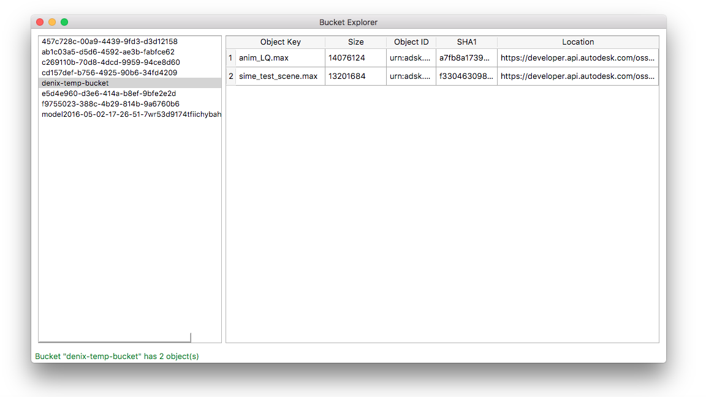

# Bucket Explorer
A small utility for getting the list available buckets along with their
content.

The main idea of this sample is to illustrate how to explore the content
of available buckets, using just the small part of Forge Data Management API.

