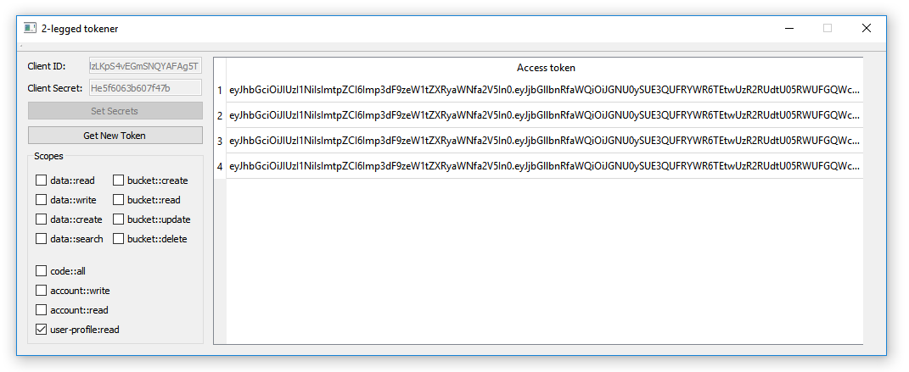

# 2-legged Token Utility
A small utility for getting 2-legged access tokens with different scopes.

The main idea of this sample is illustration of how to integrate Forge OAuth
2-legged token "acquirer" into your application.

***Mention:*** For simplicity reasons, the logic for showing/updating the
 expiration time along with scope for each token was excluded from this
 sample, but will appear in a more advanced version.

